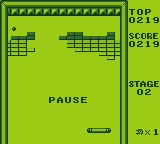
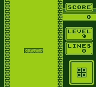
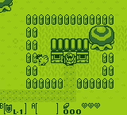

# C-GBoy
A Gameboy (not color!!!) emulator made from scratch with the C language and the SDL2 lib

this is my first attempt at making something involving emulation, I've tried to keep the IA use at the bare minimum (only bug fixes and help understanding the documentation)

## Demos

### Alleyway: 


### Tetris: 


### The Legend of Zelda: Link's Awakening:


## The Anatomy of the emulator

### CPU
The CPU is made from a list of 256 functions + 256 prefix CB functions, 7 8-bit registers plus 3 16-bit registers made from the union of 2 8-bit registers, timed cycles to run roms with precision and all of that with unit tests to assure the expected behavior

### RAM

```C
typedef struct Memory {
    uint8_t MBC_type;
    uint8_t *game_rom;       // read binary da ROM intira e dar memcpy para ca
    uint8_t MBC_curr_bank;
    uint8_t VRAM[0x2000];    // inicia -> 0x8000 | final ->0x9FFF
    uint8_t cartRAM[0x2000]; // inicia -> 0xA000 | final ->0xBFFF
    uint8_t WRAM[0x2000];    // inicia -> 0xC000 | final ->0xDFFF
    uint8_t OAM[0x00A0];     // inicia -> 0xFE00 | final ->0xFE9F
    uint8_t IO[0x0080];      // inicia -> 0xFF00 | final ->0xFF7F
    uint8_t HRAM[0x007F];    // inicia -> 0xFF80 | final ->0xFFFE
    uint8_t IE;              // endereço -> 0xFFFF
    MBC_Root MBC_register;
    int game_rom_lenght;
} GB_Memory;
```

